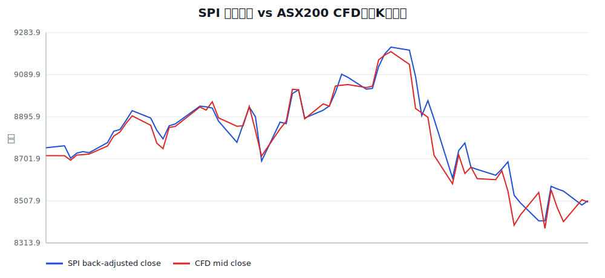
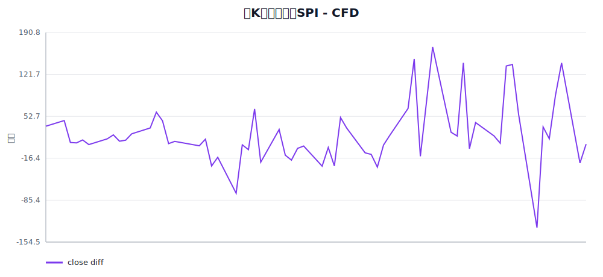
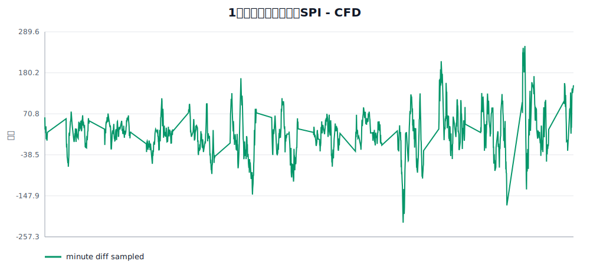
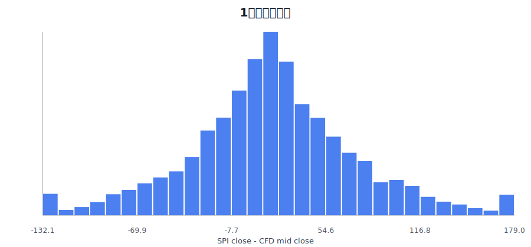

# SPI 连续合约与 ASX200 CFD 数据对比分析报告

## 结论摘要

本报告比较 `2026-01-01` 到 `2026-03-31` 期间两组数据：

- **SPI**：`ibkrData` 合成的 SPI as-of 连续期货，使用 `back_adjusted` 调整。
- **ASX200 CFD**：`/home/yuanjs/projects/tradehistory/backend/databases/tradehistory.db` 中的 CFD 日K和 1 分钟数据，使用数据库内 `mid_*` 字段。

核心结论：

1. 两组数据走势高度一致，但价格层级存在稳定偏差。日K close 差值 `SPI - CFD` 的均值为 **23.91 点**，中位数为 **13.60 点**。
2. 1分钟级别可精确对齐的 bar 数为 **62,749**，分钟 close 差值均值为 **19.37 点**，平均绝对差为 **45.33 点**。
3. 2026-03-17 发生一次 SPI 换月：`APH6 -> APM6`，gap 为 **46 点**。由于 SPI 使用 back-adjusted，换月前的期货历史价格会整体加上该 gap；CFD 数据没有这种显式换月调整。
4. CFD 分钟数据存在 bid/offer spread。样本期内 CFD 1分钟 close spread 均值约为 **2.40 点**，这会让使用 bid、offer 或 mid 的对比结果不同。

## 数据口径

### SPI 连续合约

- 日K来源：`continuous_futures_daily_asof('SPI', '2026-01-01', '2026-03-31', 'back_adjusted')`
- 1分钟来源：`continuous_futures_minute_asof_adjusted('SPI', '2026-01-01', '2026-04-01', '2026-04-01', 'back_adjusted')`
- 时区：数据库时间为 UTC；SPI session boundary 按 `Australia/Sydney 17:10` 计算并转换为 UTC。

### ASX200 CFD

- 日K来源：`tradehistory/backend/databases/tradehistory.db.candles_daily`
- 1分钟来源：`tradehistory/backend/databases/tradehistory.db.candles_1m`
- CFD 价格：使用数据库内 `mid_open/mid_high/mid_low/mid_close` 字段；spread 由 `ofr_close - bid_close` 统计。
- CFD 日K date：直接使用 `candles_daily.date`；分钟统计中的 session date 按 `Australia/Sydney 17:10` 计算，用于估算该日的分钟覆盖数量。

## 数据覆盖

| 项目 | SPI | CFD | 共同样本 |
|---|---:|---:|---:|
| 日K session 数 | 62 | 77 | 62 |
| 1分钟 bar 数 | 71,670 | 86,193 | 62,749 |

## 图表

### 日K收盘价对比

### 日K收盘价差

### 1分钟收盘价差抽样

### 1分钟价差分布

## 统计摘要

### 日K close 差值：SPI - CFD

| 指标 | 点数 |
|---|---:|
| 样本数 | 62 |
| 均值 | 23.91 |
| 中位数 | 13.60 |
| 平均绝对差 | 38.41 |
| 标准差 | 51.95 |
| 最小值 | -130.70 |
| 5%分位 | -29.38 |
| 95%分位 | 140.67 |
| 最大值 | 167.00 |

### 1分钟 close 差值：SPI - CFD

| 指标 | 点数 |
|---|---:|
| 样本数 | 62,749 |
| 均值 | 19.37 |
| 中位数 | 18.70 |
| 平均绝对差 | 45.33 |
| 标准差 | 57.82 |
| 最小值 | -233.80 |
| 5%分位 | -74.50 |
| 95%分位 | 113.50 |
| 最大值 | 334.60 |

### CFD bid/offer spread

| 指标 | 点数 |
|---|---:|
| 样本数 | 62,749 |
| 均值 | 2.40 |
| 中位数 | 3.00 |
| 95%分位 | 4.00 |
| 最大值 | 5.00 |

## SPI 换月事件

| 合约切换 | effective_roll_time | gap | ratio | rule |
|---|---|---:|---:|---|
| APH6 -> APM6 | 2026-03-17 06:10:00+00:00 | 46.00 | 1.00534325 | safety_2bd_before_expiry_asof |

## 日K差异最大的日期

| session_date | SPI close | CFD close | SPI-CFD | SPI合约 | CFD分钟数 |
|---|---:|---:|---:|---|---:|
| 2026-03-06 | 8885.0 | 8718.0 | 167.0 | APH6 | 1432 |
| 2026-03-03 | 9081.0 | 8933.8 | 147.2 | APH6 | 1158 |
| 2026-03-11 | 8775.0 | 8634.1 | 140.9 | APH6 | 1432 |
| 2026-03-27 | 8553.0 | 8412.2 | 140.8 | APM6 | 1347 |
| 2026-03-19 | 8534.0 | 8395.8 | 138.2 | APM6 | 1400 |
| 2026-03-18 | 8688.0 | 8552.4 | 135.6 | APM6 | 1427 |
| 2026-03-23 | 8416.0 | 8546.7 | -130.7 | APM6 | 0 |
| 2026-03-26 | 8563.0 | 8476.1 | 86.9 | APM6 | 1439 |
| 2026-03-05 | 8970.0 | 8893.3 | 76.7 | APH6 | 1427 |
| 2026-02-02 | 8778.0 | 8852.0 | -74.0 | APH6 | 0 |

## 差异来源分析

1. **标的不同**：SPI 是交易所期货，ASX200 CFD 是券商报价产品。CFD 通常会跟随指数/期货价格，但包含券商定价、spread、融资和交易时段处理差异。
2. **换月调整不同**：SPI 连续合约在 2026-03-17 发生 `APH6 -> APM6` 换月，back-adjusted 会把已知 gap 加到更早的历史价格上。CFD 没有期货合约换月链条，因此不会出现同样的历史回调。
3. **日切规则敏感**：ASX200 的交易 session 跨 UTC 日期。如果按 UTC 日历聚合，日K close 和 volume 会错位。本报告的 CFD 日K直接采用 `candles_daily.date`，分钟覆盖统计才按 `Australia/Sydney 17:10` 估算。
4. **bid/offer 与 mid 选择**：CFD 文件同时有 BID/OFR。本报告用 mid 作为中性价格；如果策略实盘用买价或卖价，和 SPI 的差值会系统性偏移约半个 spread。
5. **缺失分钟与交易时段差异**：共同分钟样本只统计两边都有 bar 的 UTC 分钟。任一方在休市、维护、缺数据时都会被排除；日K对比则直接使用两边各自的日K口径。

## 对回测的建议

1. 如果目标是用 SPI 替代 ASX200 CFD 回测，应优先验证信号对 **相对变化** 的敏感性，而不是只比较绝对价格。
2. 对使用 KDJ、均线、突破等指标的策略，建议同时跑：
   - SPI `back_adjusted`
   - SPI `ratio_adjusted`
   - CFD mid
3. 对涉及止损、止盈、固定点差阈值的逻辑，需要单独校正 SPI 与 CFD 的平均价格偏移和 spread。
4. 如果未来要更贴近 CFD 实盘，应考虑在 SPI 回测成交价格上叠加 CFD spread/slippage 模型。

## 输出文件

- `daily_comparison.csv`：逐 session 日K对比。
- `minute_comparison_sample.csv`：1分钟对齐样本抽样。
- `daily_close_overlay.svg`：日K close 走势对比。
- `daily_close_diff.svg`：日K close 差值。
- `minute_close_diff_sample.svg`：分钟 close 差值抽样。
- `minute_diff_histogram.svg`：分钟 close 差值分布。
